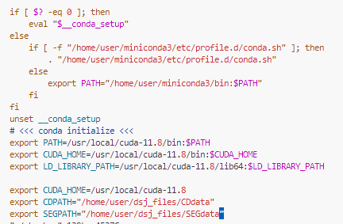

# ChangeCLIP: Remote sensing change detection with multimodal vision-language representation learning  
https://www.sciencedirect.com/science/article/pii/S0924271624000042  

English | [简体中文](README_zh-CN.md)
## 1. In order to facilitate the use of relative paths, CDPATH is set in the ~/.bashrc file. Here is how to add this setting in the ~/.bashrc。
     
   After adding CDPATH as mentioned above, you can quickly navigate to the respective data path in the following way:  
```
import os  
data_root = os.path.join(os.environ.get("CDPATH"), 'SYSU-CD')
```
## 2. I will use the SYSU-CD dataset as an example to introduce the usage of the code. First, use tools/general/write_path.py to generate a txt file for the dataset path. The format is as follows (for details, please refer to the code):  
```
/home/user/dsj_files/CDdata/SYSU-CD/test/time1/03414.png  /home/user/dsj_files/CDdata/SYSU-CD/test/time2/03414.png  /home/user/dsj_files/CDdata/SYSU-CD/test/label/03414.png
/home/user/dsj_files/CDdata/SYSU-CD/test/time1/00708.png  /home/user/dsj_files/CDdata/SYSU-CD/test/time2/00708.png  /home/user/dsj_files/CDdata/SYSU-CD/test/label/00708.png
/home/user/dsj_files/CDdata/SYSU-CD/test/time1/03907.png  /home/user/dsj_files/CDdata/SYSU-CD/test/time2/03907.png  /home/user/dsj_files/CDdata/SYSU-CD/test/label/03907.png
/home/user/dsj_files/CDdata/SYSU-CD/test/time1/03107.png  /home/user/dsj_files/CDdata/SYSU-CD/test/time2/03107.png  /home/user/dsj_files/CDdata/SYSU-CD/test/label/03107.png
/home/user/dsj_files/CDdata/SYSU-CD/test/time1/02776.png  /home/user/dsj_files/CDdata/SYSU-CD/test/time2/02776.png  /home/user/dsj_files/CDdata/SYSU-CD/test/label/02776.png
/home/user/dsj_files/CDdata/SYSU-CD/test/time1/01468.png  /home/user/dsj_files/CDdata/SYSU-CD/test/time2/01468.png  /home/user/dsj_files/CDdata/SYSU-CD/test/label/01468.png
/home/user/dsj_files/CDdata/SYSU-CD/test/time1/00026.png  /home/user/dsj_files/CDdata/SYSU-CD/test/time2/00026.png  /home/user/dsj_files/CDdata/SYSU-CD/test/label/00026.png
/home/user/dsj_files/CDdata/SYSU-CD/test/time1/02498.png  /home/user/dsj_files/CDdata/SYSU-CD/test/time2/02498.png  /home/user/dsj_files/CDdata/SYSU-CD/test/label/02498.png
/home/user/dsj_files/CDdata/SYSU-CD/test/time1/02439.png  /home/user/dsj_files/CDdata/SYSU-CD/test/time2/02439.png  /home/user/dsj_files/CDdata/SYSU-CD/test/label/02439.png
/home/user/dsj_files/CDdata/SYSU-CD/test/time1/01057.png  /home/user/dsj_files/CDdata/SYSU-CD/test/time2/01057.png  /home/user/dsj_files/CDdata/SYSU-CD/test/label/01057.png
```
## 3.Use the CLIP model to perform inference on the SYSU-CD dataset. https://github.com/openai/CLIP, Generate a confidence JSON file.  
   3.1  First, it is necessary to install the CLIP project. Run the following command:  
```
conda install --yes -c pytorch pytorch=1.7.1 torchvision cudatoolkit=11.0
pip install ftfy regex tqdm
pip install git+https://github.com/openai/CLIP.git
```
   3.2 Then run the following command:
```
cd tools
bash clip_infer_sysu.sh
```
   3.3  After running the command, the following files will be generated:
```
/home/user/dsj_files/CDdata/SYSU-CD/train/time1_clipcls_56_vit16.json
/home/user/dsj_files/CDdata/SYSU-CD/train/time2_clipcls_56_vit16.json
/home/user/dsj_files/CDdata/SYSU-CD/val/time1_clipcls_56_vit16.json
/home/user/dsj_files/CDdata/SYSU-CD/val/time2_clipcls_56_vit16.json
/home/user/dsj_files/CDdata/SYSU-CD/test/time1_clipcls_56_vit16.json
/home/user/dsj_files/CDdata/SYSU-CD/test/time2_clipcls_56_vit16.json
```

## 4.For training and testing, You can view the contents of the tools/train.sh file and set the training plan yourself.

## 5.We have made the weights and log files of the training process public. If you cannot download the files of Baidu Netdisk, you can send me an email and I will reply in time and provide download links from other sources.
[ChangeCLIP_best_weights](https://pan.baidu.com/s/1JmBPzg4wRwbgIqRU9Pep5g), 提取码: rscd


# Acknowledgements  
This repo benefits from awesome works of [mmsegmentation](https://github.com/open-mmlab/mmsegmentation), [DenseCLIP](https://github.com/raoyongming/DenseCLIP),
[CLIP](https://github.com/openai/CLIP). Please also consider citing them.  

# Cite
```bibtex
@article{DONG202453,
title = {ChangeCLIP: Remote sensing change detection with multimodal vision-language representation learning},
journal = {ISPRS Journal of Photogrammetry and Remote Sensing},
volume = {208},
pages = {53-69},
year = {2024},
issn = {0924-2716},
doi = {https://doi.org/10.1016/j.isprsjprs.2024.01.004},
url = {https://www.sciencedirect.com/science/article/pii/S0924271624000042},
author = {Sijun Dong and Libo Wang and Bo Du and Xiaoliang Meng}
}
```